```{r setup, include=FALSE}
knitr::opts_chunk$set(echo = FALSE)
library(sapfluxnetr)
library(tidyverse)
library(ggridges)
library(taxonlookup)
library(lubridate)
library(viridis)
library(quantreg)
load('metrics_objects.RData')
```

## La transpiración como principal flujo evaporativo global
- La transpiración representa globalmente un ~60% de la ET terrestre y los
bosques transpiran un ~60% de esta ET.

<div class="centered">
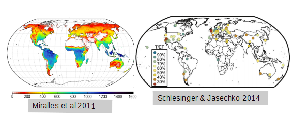 
</div>

## Regulación de la transpiración y resistencia a la sequía

- La regulación de la transpiración se refleja en la magnitud y 
los patrones temporales del flujo de savia.

<div class="centered">
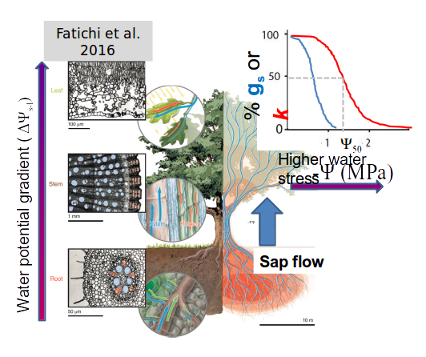 
</div>

## Medida de flujo de savia con métodos térmicos

- El flujo de savia es la medida de los patrones temporales
del uso de agua, con una mayor representatividad ecológica 
(especies, poblaciones, tamaños de planta)

<div class="centered">
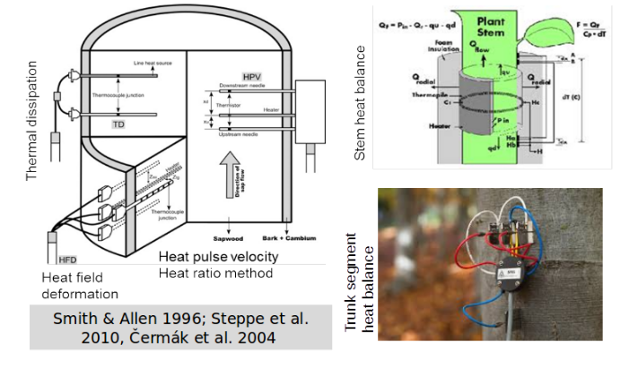
</div>

## Datos globales de flujo de savia, por qué no?

<div class="centered">
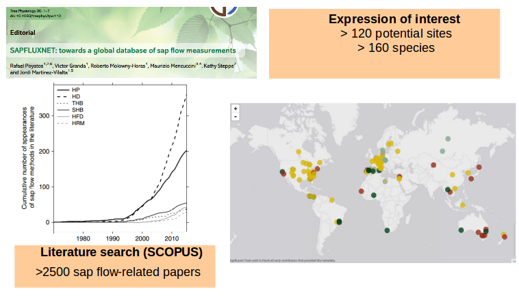
</div>

## Progreso actual

<div class="centered">
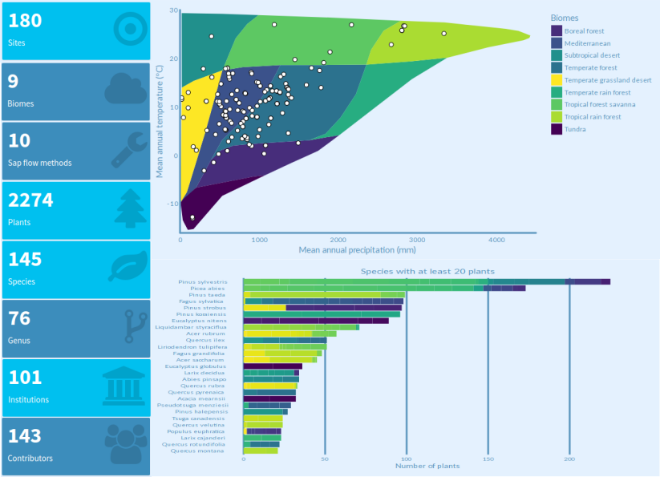
</div>

## Descripción técnica

> Para poder asegurar la calidad de los datos recibidos necesitamos un control
  de calidad **semi-automático**, **reproducible** y **robusto**. También
  necesitamos, por otro lado, almacenar los datos de tal manera que permita el
  acceso a toda la información (datos y metadatos) para simplificar el proceso.

## Control de calidad

<div class="centered">
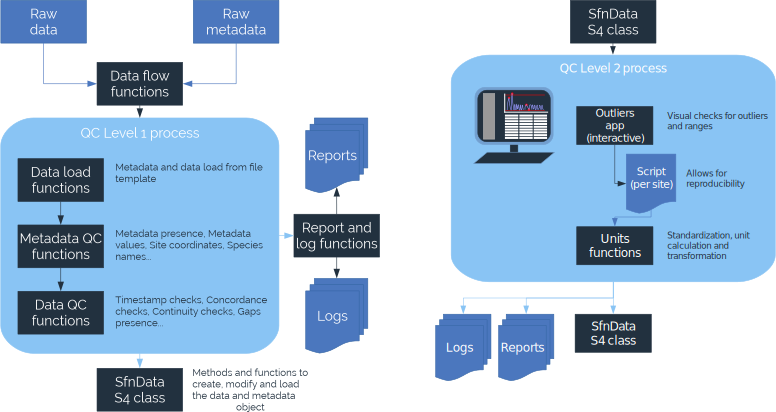
</div>

## Almacenamiento de los datos

Toda la información de un sitio (datos de flujo, datos ambientales, metadatos
de sitio, stand, especies, plantas y ambientales) se combinan en un solo
objeto, gracias a la clase S4 `sfn_data`:

<div class="centered">
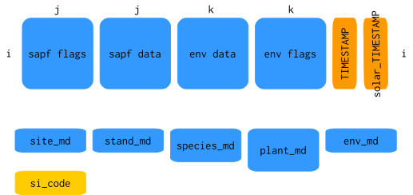
</div>

## Almacenamiento de los datos {.smaller}

Así, es sencillo acceder a los datos de flujo, por ejemplo:

```{r, echo=TRUE}
read_sfn_data('ARG_MAZ') %>% get_sapf_data()
```

## Herramientas desarrolladas en el proyecto

Monitorización del Control de Calidad y del progreso del proyecto, gracias
a aplicaciones `shiny`:

<div class="centered">
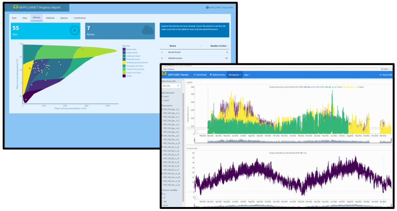
</div>

## Herramientas desarrolladas en el proyecto

Paquetes de R para trabajar con los datos

- `sapfluxnetQC1`:  
  Encargado de toda la parte semi-automática de control de
  calidad. Destinado a uso interno del proyecto, pero auditable por cualquier
  interesado (Data contributors, Journal reviewers...):  
  https://github.com/sapfluxnet/sapfluxnetQC1

- `sapfluxnetr`:  
  Herramientas y utilidades para el análisis de los datos
  recopilados en SAPFLUXNET. Destinado al público interesado (Data contributors,
  Investigadores...) y completamente disponible:  
  https://github.com/sapfluxnet/sapfluxnetr


## Escalado del uso del agua 

SAPFLUXNET permitirá analizar la variación de la transpiración en función de 
atributos de la planta (diámetro, área de albura, área foliar).

<div class="centered">
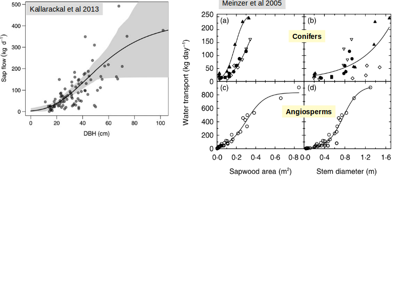
</div>

## Escalado del uso de agua

Con datos de SAPFLUXNET

```{r escalado_max, fig.align='center', fig.width=7, warning=FALSE}
tidy_metrics_taxonized %>%
  group_by(pl_code) %>%
  summarise(sapflow = quantile(sapflow_q_95, na.rm = TRUE, probs = 0.95),
            pl_dbh = mean(pl_dbh, na.rm = TRUE),
            st_basal_area = mean(st_basal_area, na.rm = TRUE),
            group = unique(group),
            genus = unique(genus),
            si_biome = unique(si_biome),
            pl_species = unique(pl_species),
            st_basal_area = mean(st_basal_area, na.rm = TRUE)) %>%
  filter(genus %in% c('Eucalyptus', 'Quercus', 'Pinus')) %>%
  ggplot(aes(x = pl_dbh, y = sapflow, colour = genus)) +
  geom_point(aes(size = st_basal_area), alpha = 0.4) +
  stat_smooth(se = FALSE, method = 'lm', size = 2) +
  # facet_wrap(~ pl_species, ncol = 3) +
  scale_colour_viridis(discrete = TRUE, option = 'C') +
  labs(
    colour = '', size = 'Área basal',
    x = 'Diametro Altura del Pecho [cm]',
    y = expression("J"['t max']*" cm"^3/"h"),
    title = 'Maximum daily flow responses to DBH',
    subtitle = 'by genera'
  ) +
  theme(legend.position = 'bottom')
```


## Respuestas a la demanda evaporativa

<div class="centered">
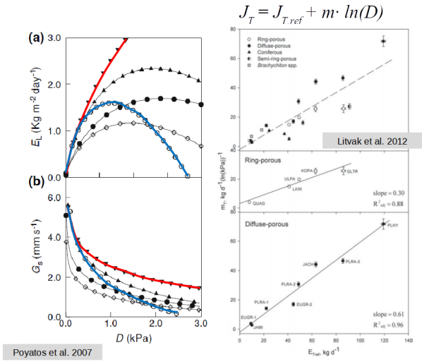
</div>

## Respuestas a la demanda evaporativa

Con datos de SAPFLUXNET

```{r vpd_response, fig.align='center', fig.width=7, warning=FALSE}
quantreg::nlrq(
  # sapflow_q_95 ~ SSasympOrig(vpd_q_95, Asym, lrc),
  sapflow_q_95 ~ Asym * (1 - exp(-exp(lrc) * vpd_q_95)),
  start = list(Asym = 100000, lrc = 0.9),
  tidy_metrics_taxonized %>% filter(genus == 'Eucalyptus'),
  tau = 0.99
) -> euc_model

quantreg::nlrq(
  sapflow_q_95 ~ Asym * (1 - exp(-exp(lrc) * vpd_q_95)),
  tidy_metrics_taxonized %>% filter(genus == 'Quercus'),
  start = list(Asym = 25000, lrc = 0.9),
  tau = 0.99
) -> que_model

quantreg::nlrq(
  sapflow_q_95 ~ Asym * (1 - exp(-exp(lrc) * vpd_q_95)),
  start = list(Asym = 25000, lrc = 0.9),
  tidy_metrics_taxonized %>% filter(genus == 'Pinus'),
  tau = 0.99
) -> pin_model

seqvpd <- data.frame(vpd = seq(0, 10, by = 0.05))
euc_line <- data_frame(
  vpd_q_95 = tidy_metrics_taxonized %>%
    filter(genus == 'Eucalyptus') %>%
    pull(vpd_q_95),
  genus = 'Eucalyptus',
  fit = predict(euc_model, newdata = seqvpd)
)

pin_line <- data_frame(
  vpd_q_95 = tidy_metrics_taxonized %>%
    filter(genus == 'Pinus') %>%
    pull(vpd_q_95),
  genus = 'Pinus',
  fit = predict(pin_model, newdata = seqvpd)
)

que_line <- data_frame(
  vpd_q_95 = tidy_metrics_taxonized %>%
    filter(genus == 'Quercus') %>%
    pull(vpd_q_95),
  genus = 'Quercus',
  fit = predict(que_model, newdata = seqvpd)
)

tidy_metrics_taxonized %>%
  ggplot(aes(x = vpd_q_95, y = sapflow_q_95, colour = genus)) +
  geom_point(alpha = 0.1) +
  geom_line(aes(x = vpd_q_95, y = fit), data = euc_line, size = 2) +
  geom_line(aes(x = vpd_q_95, y = fit), data = pin_line, size = 2) +
  geom_line(aes(x = vpd_q_95, y = fit), data = que_line, size = 2) +
  # stat_smooth(se = FALSE, size = 2) +
  # facet_wrap(~ pl_species, ncol = 3, scales = 'fixed') +
  scale_colour_viridis(discrete = TRUE, option = 'C') +
  labs(
    colour = '',
    x = expression("VPD"['max']*" kPa"),
    y = expression("J"['t max']*" cm"^3/"h"),
    title = 'Sap flow responses to VPD',
    subtitle = 'by genera'
  ) +
  theme(legend.position = 'bottom')
```

## Respuestas a la humedad del suelo

<div class="centered">
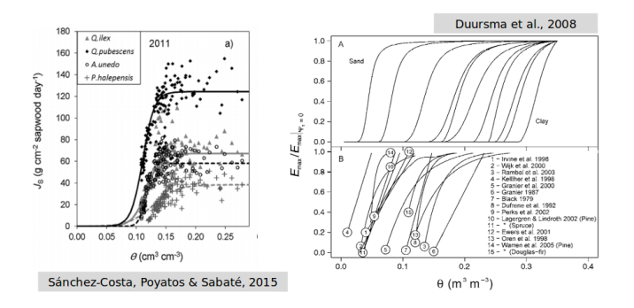
</div>

## Respuestas temporales

```{r temporal, fig.align='center', fig.width=8, warning=FALSE, message=FALSE}
genera_tidy %>%
  filter(pl_species %in% c('Eucalyptus dives', 'Eucalyptus nitens',
                           'Eucalyptus cypellocarpa', 'Eucalyptus globulus')) %>%
  mutate(month = month(TIMESTAMP, label = TRUE)) %>%
  ggplot(aes(x = sapflow_q_95, y = month, fill = ..x..)) +
  geom_density_ridges_gradient(scale = 3, rel_min_height = 0.01) +
  # geom_density_ridges_gradient(scale = 3) +
  scale_fill_viridis(name = expression('Sap Flow'*' [cm'^3/"h]"), option = 'C') +
  labs(
    x = expression('Maximum Sap Flow as Q95'*' cm'^3/"h"),
    y = 'Month',
    title = 'Month variation of daily maximum flows',
    subtitle = 'Eucalyptus species'
  ) +
  facet_wrap(~ pl_species, ncol = 2, scales = 'free_x') +
  theme(legend.position = 'bottom',
        legend.text = element_text(size = 5))
```

## Respuestas temporales

```{r temporal_2, fig.align='center', fig.width=8, warning=FALSE, message=FALSE}
genera_tidy %>%
  filter(pl_species %in% c('Quercus petraea', 'Quercus pubescens',
                           'Quercus phellos', 'Quercus ilex')) %>%
  # filter(str_detect(pl_species, 'Quercus')) %>%
  mutate(month = month(TIMESTAMP, label = TRUE)) %>%
  ggplot(aes(x = sapflow_q_95, y = month, fill = ..x..)) +
  geom_density_ridges_gradient(scale = 3, rel_min_height = 0.01) +
  # geom_density_ridges_gradient(scale = 3) +
  # geom_density_ridges_gradient(scale = 3) +
  scale_fill_viridis(name = expression('Sap Flow'*' [cm'^3/"h]"), option = 'C') +
  labs(
    x = expression('Maximum Sap Flow as Q95'*' [cm'^3/"h]"),
    y = 'Month',
    title = 'Month variation of daily maximum flows',
    subtitle = 'Quercus species'
  ) +
  facet_wrap(~ pl_species, ncol = 2, scales = 'free_x') +
  theme(legend.position = 'bottom',
        legend.text = element_text(size = 5))
```

## Agradecimientos {.twocol}

**Gracias por la atención!!**


Este proyecto está financiado por el Ministerio de Economía y Competitividad  

y no hubiese sido posible sin la amable colaboración de todos los
*"data contributors"*.


